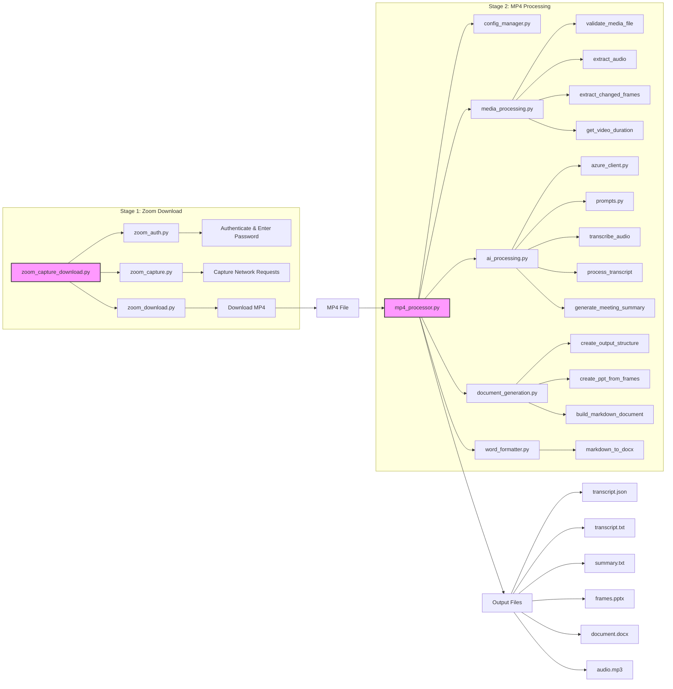

# Zoom Recording Processor – Technical Documentation

**Zoom Recording Processor** is a production‑ready Python application that automates the download of Zoom recordings and converts them into fully‑formatted artefacts: transcripts, AI summaries, presentation decks and Word reports. The codebase is designed for reliability in unattended, headless environments and can be integrated into larger data‑engineering workflows.

---

## 1. Architecture Overview

When provided with a Zoom recording URL (or a local MP4), the program:

1. Establishes an authenticated browser session using nodriver (undetected Chrome), navigates to the recording and retrieves the MP4 asset—even when the link is password‑protected or requires cookie consent. Robust retry logic keeps the process alive on flaky networks.
2. Splits the download into audio and video components. Audio is streamed into Azure Speech Services for diarised transcription; key video frames are detected by histogram analysis and saved for possible slide reconstruction.
3. Feeds the transcript to Azure OpenAI via a modular LLM client. A configurable prompt produces a structured summary that emphasises metrics, decisions and action items; you may substitute any deployed GPT‑compatible model.
4. Assembles the outputs—raw JSON from Speech Services, clean text, optional PowerPoint, summary text and a fully‑styled Word document—and places them in a versioned directory tree.

Because every function is exposed as a standalone class, you can execute the end‑to‑end pipeline, or call the downloader, transcription engine or document generator in isolation.

---

## 2. Key Implementation Details

### Browser Automation
- **Technology**: nodriver (undetected Chrome) for stealth browser automation
- **Authentication**: Cookie persistence for session reuse
- **Network Capture**: Intercepts recording info requests to extract MP4 URLs
- **Resilience**: Automatic retry on failures, handles cookie banners

### Media Processing
- **Audio**: FFmpeg extracts to 48 kHz mono WAV/MP3
- **Frame Detection**: OpenCV histogram analysis with configurable thresholds
- **Frame Export**: Direct PowerPoint generation from detected frames
- **Format Support**: MP4, with extensible architecture for other formats

### AI Integration
- **Transcription**: Azure Speech Services with speaker diarization
- **LLM Client**: Modular architecture supporting multiple providers
  - `azure_client.py`: Azure OpenAI implementation
  - Uses litellm for consistent interface
  - Easy to extend with other providers
- **Prompts**: Centralized in `prompts.py` for easy customization

### Configuration Management
- **Hierarchy**: CLI args > Environment > JSON > Defaults
- **Sources**: `.env` files, environment variables, config.json
- **Validation**: Type-safe dataclasses with validation
- **Security**: Credentials never logged, sensitive data protected

### Logging & Monitoring
- **Setup**: Centralized logger configuration with rotation
- **Levels**: Configurable verbosity (DEBUG/INFO/WARNING/ERROR)
- **Output**: Colored console + rotating file handlers
- **Progress**: tqdm bars for long operations

---

## 3. Repository Structure

```text
zoom-webcast-downloader/
├── src/
│   ├── zoom_capture_download.py    # Zoom recording capture & download
│   ├── mp4_processor.py             # Media processing entry‑point
│   └── utils/                       # Support modules
│       ├── config_manager.py        # Configuration management
│       ├── logger_setup.py          # Logging configuration
│       ├── zoom_download/           # Zoom-specific utilities
│       │   ├── zoom_auth.py         # Authentication handler
│       │   ├── zoom_capture.py      # Network request capture
│       │   └── zoom_download.py     # MP4 downloader
│       └── mp4_processing/          # Media processing utilities
│           ├── ai_processing.py     # Transcription & summarization
│           ├── azure_client.py      # Azure LLM client
│           ├── prompts.py           # LLM prompt templates
│           ├── media_processing.py  # Audio/video processing
│           ├── document_generation.py # Output generation
│           └── word_formatter.py    # Word document formatting
├── examples/                        # Example scripts and usage
├── output/                          # Default output directory
├── logs/                            # Application logs
├── config.json.template             # Configuration template
└── requirements.txt                 # Python dependencies
```

### Component Flow Diagram



---

## 4. Installation & Setup

### Prerequisites
- Python 3.8+
- FFmpeg (for media processing)
- Chrome/Chromium browser
- Azure account with:
  - Speech Services resource
  - OpenAI deployment

### Installation Steps

1. **Clone and install dependencies**
   ```bash
   git clone https://github.com/your-org/zoom-webcast-downloader.git
   cd zoom-webcast-downloader
   pip install -r requirements.txt
   ```

2. **Configure Azure credentials**
   ```bash
   cp config.json.template config.json
   # Edit config.json with your Azure endpoints and keys
   ```

3. **Optional: Environment variables**
   ```bash
   export AZURE_SPEECH_KEY="your-key"
   export AZURE_SPEECH_ENDPOINT="https://your-resource.cognitiveservices.azure.com"
   export AZURE_OPENAI_ENDPOINT="https://your-openai.openai.azure.com/"
   export AZURE_OPENAI_KEY="your-openai-key"
   ```

---

## 5. CLI Usage

### Zoom Download
```bash
# Basic download
python src/zoom_capture_download.py \
  --url "https://zoom.us/rec/share/..." \
  --password "p@ssw0rd"

# With custom output and debug logging
python src/zoom_capture_download.py \
  --url "https://zoom.us/rec/share/..." \
  --password "p@ssw0rd" \
  --output-dir "./downloads" \
  --debug
```

### MP4 Processing
```bash
# Process with all features
python src/mp4_processor.py process \
  --mp4-path "./meeting.mp4" \
  --with-frames \
  --with-ppt \
  --with-transcript \
  --with-summary

# Skip transcription for large files
python src/mp4_processor.py process \
  --mp4-path "./meeting.mp4" \
  --no-transcribe \
  --with-frames
```

### Configuration Management
```bash
# Create configuration template
python src/mp4_processor.py create-template

# Validate configuration
python src/mp4_processor.py validate-config
```

---

## 6. Python API Reference

### MP4 Processor
```python
from utils.mp4_processing.ai_processing import AIProcessor
from utils.config_manager import ConfigManager

# Load configuration
config = ConfigManager.from_file("config.json")

# Initialize processor
ai_processor = AIProcessor(
    speech_key=config.azure.speech_key,
    speech_endpoint=config.azure.speech_endpoint,
    azure_endpoint=config.azure.openai_endpoint,
    model_name=config.azure.model_name,
    api_key=config.azure.openai_key
)

# Transcribe audio
transcript_json = ai_processor.transcribe_audio("audio.wav")
transcript_text = ai_processor.process_transcript(transcript_json)

# Generate summary
summary = ai_processor.generate_meeting_summary(transcript_text)
```

### Custom LLM Client
```python
from utils.mp4_processing.azure_client import AzureLLMClient

# Initialize client
client = AzureLLMClient(
    azure_endpoint="https://your-openai.openai.azure.com/",
    api_key="your-key",
    model_name="azure/gpt-4"
)

# Simple completion
response = client.complete("Summarize this text: ...")

# With custom parameters
response = client.complete(
    prompt="Your prompt",
    max_completion_tokens=2000,
    temperature=0.7
)
```

### Custom Prompts
```python
# Edit src/utils/mp4_processing/prompts.py
MEETING_SUMMARY_PROMPT = """Your custom prompt template..."""

# Or create new prompts
EARNINGS_CALL_PROMPT = """Specialized prompt for earnings calls..."""
```

---

## 7. Extending the System

### Adding New LLM Providers

1. Create a new client in `utils/mp4_processing/`:
```python
# openai_client.py
from litellm import completion

class OpenAIClient:
    def __init__(self, api_key: str):
        self.api_key = api_key
        
    def complete(self, prompt: str, **kwargs):
        # Implementation using litellm
        pass
```

2. Update `ai_processing.py` to use the new client:
```python
# Import based on config
if config.provider == "openai":
    from .openai_client import OpenAIClient
    self.llm_client = OpenAIClient(api_key)
```

### Adding New Media Formats

1. Extend `MediaProcessor` class:
```python
def extract_audio_from_webm(self, webm_path: Path) -> Path:
    # WebM-specific extraction logic
    pass
```

2. Update validation logic:
```python
SUPPORTED_FORMATS = ['.mp4', '.webm', '.avi']
```

### Custom Document Templates

1. Create new formatter in `utils/mp4_processing/`:
```python
class CustomDocFormatter(WordDocFormatter):
    def apply_corporate_branding(self, doc):
        # Custom styling
        pass
```

---

## 8. Troubleshooting

### Common Issues

**Browser automation fails**
- Ensure Chrome is installed
- Check if running in headless mode works: `--headless false`
- Verify user agent string is current

**Azure Speech API errors**
- Check audio file size (< 300MB limit)
- Verify audio format (48kHz mono WAV)
- Confirm API credentials and endpoints

**LLM timeouts**
- Increase timeout in config
- Check Azure OpenAI quota/limits
- Consider chunking large transcripts

### Debug Mode
```bash
# Enable verbose logging
python src/mp4_processor.py process --mp4-path video.mp4 --debug

# Check logs
tail -f logs/zoom_processor.log
```

### Performance Optimization

**Large Files**
- Use `--no-transcribe` and process audio separately
- Adjust frame detection threshold to reduce processing
- Consider parallel processing for multiple files

**Memory Usage**
- Process videos in chunks
- Clear frame cache between operations
- Use streaming for large downloads

---

## 9. Security Considerations

- **Credentials**: Never commit credentials to version control
- **File Paths**: Validate and sanitize all user inputs
- **Network**: Use HTTPS for all API calls
- **Storage**: Clean up temporary files after processing
- **Logging**: Ensure sensitive data is not logged

---

## 10. Contributing

1. Fork the repository
2. Create a feature branch
3. Follow existing code style and patterns
4. Add tests for new functionality
5. Update documentation
6. Submit a pull request

For detailed contribution guidelines, see CONTRIBUTING.md.